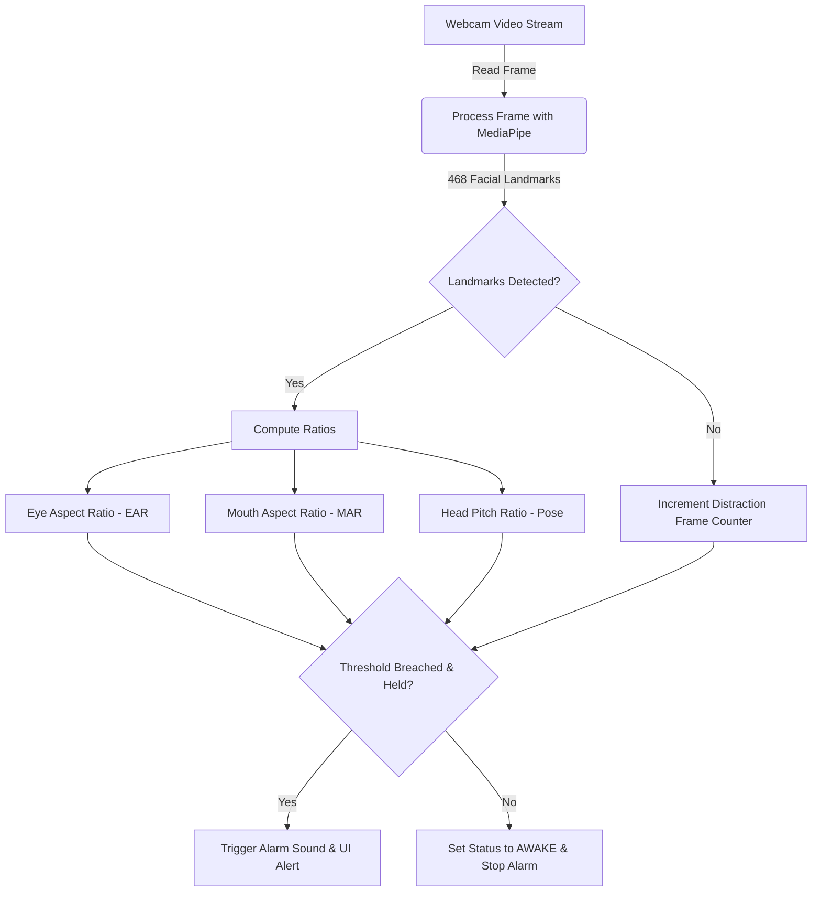

# 🚗 Real-Time Driver Drowsiness Detection System

[](https://www.python.org/)
[](https://opencv.org/)
[](https://google.github.io/mediapipe/)
[](https://opensource.org/licenses/MIT)

A lightweight, high-performance, real-time computer vision system designed to detect driver drowsiness and distractions. Using **MediaPipe Face Mesh** and direct geometric mathematical ratios, this system achieves superior CPU-only framerates (FPS) without requiring expensive GPU hardware or heavy Deep Learning inference.



---

## ✨ Key Features

1. **👀 Eye Closure Detection (Micro-sleep):**
   Computes the Eye Aspect Ratio (EAR) dynamically. If the driver closes their eyes for a consecutive number of frames, the system flags the state as `DROWSY (EYES CLOSED)` and sounds the alarm.
2. **🥱 Yawn Detection:**
   Calcules the Mouth Aspect Ratio (MAR). If the driver yawns (mouth opened wide) for longer than the safety threshold, the system flags it as `DROWSY (YAWNING)`.
3. **💤 Head Drooping (Nodding Off):**
   Estimates head pitch ratio based on Y-axis projection of central vertical landmarks. When the driver's head falls forward, the system identifies the nod-off event.
4. **⚠️ Distraction & Camera Blocked Detection:**
   Monitors face presence. If the driver turns their head completely away or the camera is blocked, a distraction alarm is triggered after a brief safety window.
5. **🔊 Audio Alert System:**
   Utilizes `pygame`'s audio mixer to trigger asynchronous, non-blocking alarm sounds, ensuring video frames continue processing smoothly.

---

## 🏗️ Project Structure

- **[main.py](file:///a:/projects/Summer-Internship/main.py):** Main application entry point, containing the webcam capture loop, threshold processing, and UI visualization.
- **[core/](file:///a:/projects/Summer-Internship/core):** Source code directory housing tracker modules.
  - [video.py](file:///a:/projects/Summer-Internship/core/video.py) - Webcam and frame grabbing interface.
  - [mesh.py](file:///a:/projects/Summer-Internship/core/mesh.py) - MediaPipe Face Mesh initialization and processing.
  - [eyes.py](file:///a:/projects/Summer-Internship/core/eyes.py) - Eye Aspect Ratio (EAR) tracking.
  - [mouth.py](file:///a:/projects/Summer-Internship/core/mouth.py) - Mouth Aspect Ratio (MAR) yawning tracker.
  - [pose.py](file:///a:/projects/Summer-Internship/core/pose.py) - Head pitch and drooping estimation.
  - [alerts.py](file:///a:/projects/Summer-Internship/core/alerts.py) - Non-blocking sound generator.
- **[docs/](file:///a:/projects/Summer-Internship/docs):** Detailed system guides and concepts.
  - [01_setup_and_testing_guide.md](file:///a:/projects/Summer-Internship/docs/01_setup_and_testing_guide.md) - Complete setup instructions.
  - [02_system_architecture.md](file:///a:/projects/Summer-Internship/docs/02_system_architecture.md) - Detailed component walkthrough.
  - [03_math_and_concepts.md](file:///a:/projects/Summer-Internship/docs/03_math_and_concepts.md) - Theoretical formulas for EAR, MAR, and Pitch.
  - [04_tech_stack_and_implementation.md](file:///a:/projects/Summer-Internship/docs/04_tech_stack_and_implementation.md) - In-depth look at underlying technologies.

---

## ⚡ Quick Start

### Prerequisites
- Python 3.8 or higher.
- A functional webcam.

### 1. Set Up Environment
Create and activate a virtual environment to keep dependencies isolated:

```bash
# Windows
python -m venv venv
.\venv\Scripts\Activate.ps1

# macOS/Linux
python3 -m venv venv
source venv/bin/activate
```

### 2. Install Dependencies
Install all required libraries listed in [requirements.txt](file:///a:/projects/Summer-Internship/requirements.txt):

```bash
pip install -r requirements.txt
```

### 3. Run the Application
Run the main script to start real-time detection:

```bash
python main.py
```
*Press `q` inside the video feed window to stop and clean up resources.*

---

## ⚙️ Configuration & Tuning

You can calibrate the sensitivity and duration thresholds of the system directly inside [main.py](file:///a:/projects/Summer-Internship/main.py#L10-L24):

| Parameter | Default Value | Description |
| :--- | :---: | :--- |
| `EAR_THRESHOLD` | `0.25` | EAR value below which eyes are considered closed. |
| `EAR_FRAMES` | `15` | Minimum consecutive frames of closed eyes to trigger the alarm. |
| `MAR_THRESHOLD` | `0.6` | MAR value above which mouth is considered yawning. |
| `MAR_FRAMES` | `15` | Minimum consecutive frames of yawning to trigger the alarm. |
| `PITCH_THRESHOLD`| `0.55` | Head pitch ratio below which the head is considered drooping. |
| `PITCH_FRAMES` | `15` | Minimum consecutive frames of head droop to trigger the alarm. |
| `DISTRACTION_FRAMES` | `30` | Consecutive frames without face detection before triggering a distraction alert. |

---

## 📖 Deep Dives & Documentation

For a more thorough understanding, explore the following documentation artifacts:

*   **Step-by-step Setup:** See [01_setup_and_testing_guide.md](file:///a:/projects/Summer-Internship/docs/01_setup_and_testing_guide.md) for how to run and troubleshoot.
*   **System Layout:** Read [02_system_architecture.md](file:///a:/projects/Summer-Internship/docs/02_system_architecture.md) to understand modular data flows.
*   **Mathematical Formulations:** Review [03_math_and_concepts.md](file:///a:/projects/Summer-Internship/docs/03_math_and_concepts.md) for formulas and MediaPipe landmark index mapping.
*   **Implementation Guide:** Check [04_tech_stack_and_implementation.md](file:///a:/projects/Summer-Internship/docs/04_tech_stack_and_implementation.md) for libraries details and rationale.

---

## 📜 License
This project is licensed under the MIT License. See the LICENSE file for details.
