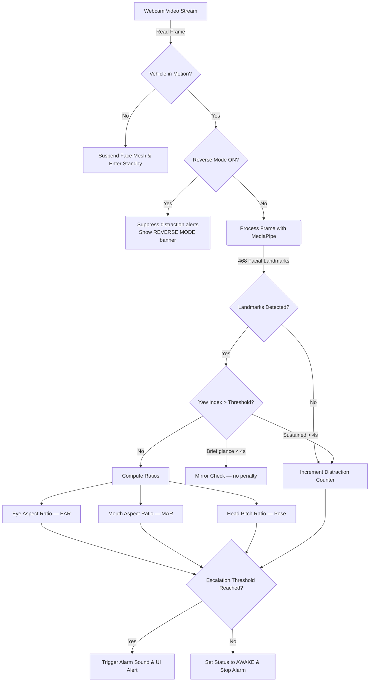

# 🚗 Real-Time Driver Drowsiness Detection System

[](https://www.python.org/)
[](https://opencv.org/)
[](https://google.github.io/mediapipe/)
[](https://opensource.org/licenses/MIT)

A lightweight, high-performance, real-time computer vision system designed to detect driver drowsiness and distractions. Using **MediaPipe Face Mesh** and direct geometric mathematical ratios, this system achieves superior CPU-only framerates without requiring expensive GPU hardware or heavy deep learning inference.

All detection thresholds are **time-based** (measured in real seconds) rather than frame counts, so the system behaves consistently at any camera FPS.



---

## ✨ Key Features

1. **👀 Eye Closure Detection (Micro-sleep):**
   Computes the Eye Aspect Ratio (EAR). If the driver's eyes remain continuously closed for **2 seconds**, the system flags `DROWSY (EYES CLOSED)`. Requires **2 such events within 45 seconds** before the alarm arms.

2. **🥱 Yawn Detection:**
   Computes the Mouth Aspect Ratio (MAR). A yawn must be held open for **≥ 1 second** to count — short mouth movements (talking, coughing) are filtered out. **3 qualifying yawns within 30 seconds** arms the alarm; the next yawn triggers it.

3. **💤 Head Drooping (Nodding Off):**
   Estimates head pitch ratio from vertical facial landmarks. The head must droop for **1.5 continuous seconds** to count as an event, **and** the EAR must also be below 0.30 (eyes partially closing) — this prevents false positives from deliberate tilts like resting your chin on your hand.

4. **⚠️ Distraction & Camera Blocked Detection:**
   Combines two mechanisms:
   - **Yaw Index** (face turned sideways): brief glances ≤ 4 seconds are tolerated as mirror checks. Beyond 4 seconds triggers distraction.
   - **Face Loss** (camera blocked / extreme head turn): if landmarks disappear for ~0.75s, a distraction event is recorded.
   **2 distraction events within 60 seconds** arms the alert.

5. **🔄 Reverse Mode:**
   Press `r` to toggle Reverse Mode. A prominent amber banner appears at the top of the frame. In this mode, face-loss distraction alerts are suppressed (the driver is expected to be looking backward). Auto-disables after 120 seconds as a safety net.

6. **🔊 Audio Alert System:**
   Uses `pygame`'s audio mixer to trigger asynchronous, non-blocking alarms — video processing continues without interruption.

7. **🚦 Vehicle Motion Standby:**
   Pauses all facial analysis when the vehicle is stationary, entering a dark standby screen to save CPU. Supports:
   - JSON mock file (for testing)
   - Physical serial GPS/OBD-II sensor
   - Always-On fallback if no sensor is attached

8. **📊 Real-Time HUD:**
   On-screen overlay showing EAR / MAR / Pitch / Yaw values, escalation event counters (e.g. `YAWN: 1/3`), motion state badge, reverse mode banner, status bar, and FPS counter.

---

## 🏗️ Project Structure

- **[main.py](file:///a:/projects/Summer-Internship/main.py):** Main application entry point — webcam loop, threshold processing, UI overlay.
- **[core/](file:///a:/projects/Summer-Internship/core):** Detection and tracking modules.
  - [video.py](file:///a:/projects/Summer-Internship/core/video.py) — Webcam capture with explicit resolution request.
  - [motion.py](file:///a:/projects/Summer-Internship/core/motion.py) — GPS serial / JSON mock vehicle motion detector.
  - [mesh.py](file:///a:/projects/Summer-Internship/core/mesh.py) — MediaPipe Face Mesh initialization.
  - [eyes.py](file:///a:/projects/Summer-Internship/core/eyes.py) — EAR tracking with time-based closure detection.
  - [mouth.py](file:///a:/projects/Summer-Internship/core/mouth.py) — MAR tracking with time-based yawn detection.
  - [pose.py](file:///a:/projects/Summer-Internship/core/pose.py) — Head pitch estimation with time-based droop detection.
  - [alerts.py](file:///a:/projects/Summer-Internship/core/alerts.py) — Non-blocking sound generator.
  - [alert_escalation.py](file:///a:/projects/Summer-Internship/core/alert_escalation.py) — Two-tier sliding-window escalation system.
- **[docs/](file:///a:/projects/Summer-Internship/docs):** Detailed system guides and concepts.
  - [01_setup_and_testing_guide.md](file:///a:/projects/Summer-Internship/docs/01_setup_and_testing_guide.md) — Setup and test instructions.
  - [02_system_architecture.md](file:///a:/projects/Summer-Internship/docs/02_system_architecture.md) — Component walkthrough.
  - [03_math_and_concepts.md](file:///a:/projects/Summer-Internship/docs/03_math_and_concepts.md) — EAR, MAR, Pitch, and Yaw formulas.
  - [04_tech_stack_and_implementation.md](file:///a:/projects/Summer-Internship/docs/04_tech_stack_and_implementation.md) — Libraries and design rationale.

---

## ⚡ Quick Start

### Prerequisites
- Python 3.8 or higher
- A functional webcam

### 1. Set Up Environment
```bash
# Windows
python -m venv venv
.\venv\Scripts\Activate.ps1

# macOS/Linux
python3 -m venv venv
source venv/bin/activate
```

### 2. Install Dependencies
```bash
pip install -r requirements.txt
```

### 3. Run the Application
```bash
python main.py
```
*Press `q` to quit · `m` to cycle motion override · `r` to toggle reverse mode.*

---

## ⚙️ Configuration & Tuning

All thresholds are defined at the top of [main.py](file:///a:/projects/Summer-Internship/main.py):

### Detection Thresholds
| Parameter | Value | Description |
| :--- | :---: | :--- |
| `EAR_THRESHOLD` | `0.25` | EAR below which eyes are considered closed |
| `MAR_THRESHOLD` | `0.6` | MAR above which mouth is considered yawning |
| `PITCH_THRESHOLD` | `0.62` | Pitch ratio below which head is considered drooping |
| `YAW_THRESHOLD` | `0.35` | Yaw asymmetry ratio above which driver is looking sideways |

### Time-Based Duration Windows
| Parameter | Value | Description |
| :--- | :---: | :--- |
| `closure_duration_seconds` | `2.0 s` | Continuous eye closure required to trigger an eye event |
| `yawn_duration_seconds` | `1.0 s` | Continuous yawn required to count as a qualifying yawn |
| `droop_duration_seconds` | `1.5 s` | Continuous head droop required to count as a nod event |
| `YAW_GRACE_SECONDS` | `4.0 s` | Sideways glance allowed before counting as distraction |
| `DISTRACTION_FRAMES` | `15 frames` | Face-lost frames before a distraction event is recorded |
| `NOD_EAR_CORRELATION` | `0.30` | EAR must also be ≤ this for a nod to count (prevents false nod from chin-on-hand) |

### Escalation Profiles (Sliding Window)
| Category | Events Required | Window | Cooldown |
| :--- | :---: | :---: | :---: |
| `eye_closure` | 2 | 45 s | 45 s |
| `yawn` | 3 | 30 s | 60 s |
| `head_nod` | 2 | 45 s | 45 s |
| `distraction` | 2 | 60 s | 60 s |

### Other Settings
| Parameter | Default | Description |
| :--- | :---: | :--- |
| `REVERSE_MODE_TIMEOUT` | `120 s` | Auto-disables reverse mode after this long |
| `MOTION_CONFIG_PATH` | `"motion_device.json"` | JSON file for simulated motion testing |
| `MOTION_SERIAL_PORT` | `None` | Serial port for live GPS/OBD-II sensor |

---

## 🎮 Keyboard Controls

| Key | Action |
| :---: | :--- |
| `q` | Quit the application |
| `m` | Cycle motion override: Auto → Force Moving → Force Stopped → Auto |
| `r` | Toggle Reverse Mode on/off |

---

## 📖 Deep Dives & Documentation

- **Setup & Testing:** [01_setup_and_testing_guide.md](file:///a:/projects/Summer-Internship/docs/01_setup_and_testing_guide.md)
- **Architecture:** [02_system_architecture.md](file:///a:/projects/Summer-Internship/docs/02_system_architecture.md)
- **Math & Formulas:** [03_math_and_concepts.md](file:///a:/projects/Summer-Internship/docs/03_math_and_concepts.md)
- **Tech Stack:** [04_tech_stack_and_implementation.md](file:///a:/projects/Summer-Internship/docs/04_tech_stack_and_implementation.md)

---

## 📜 License
This project is licensed under the MIT License. See the LICENSE file for details.
